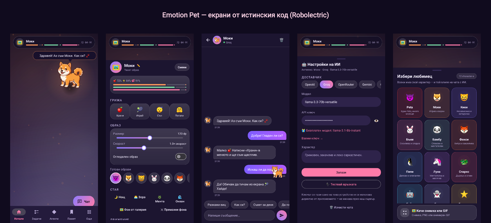
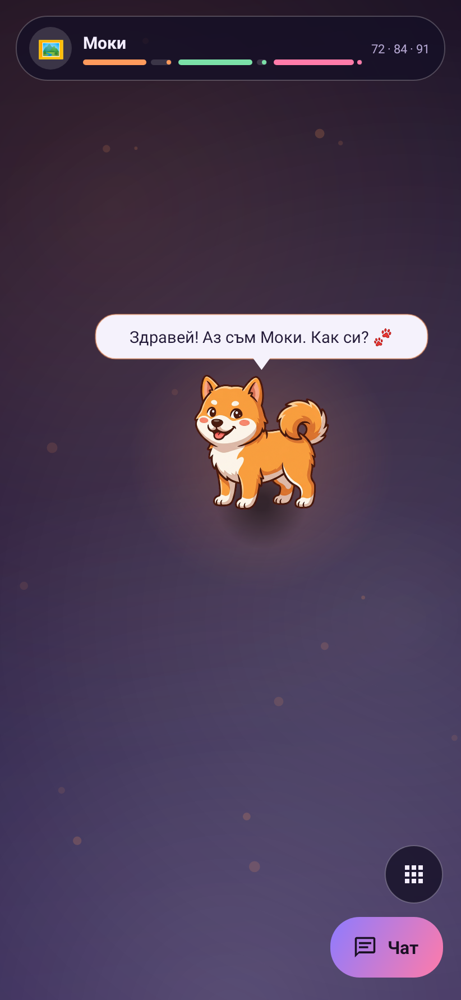
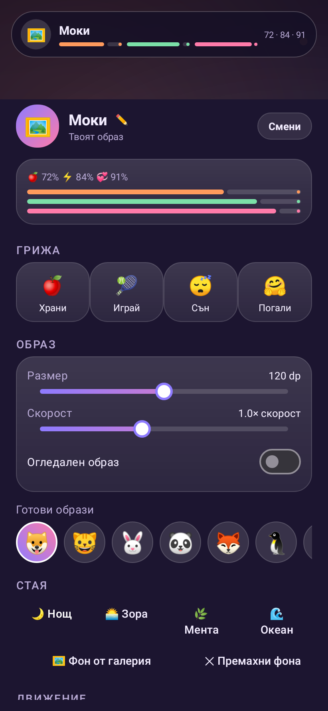
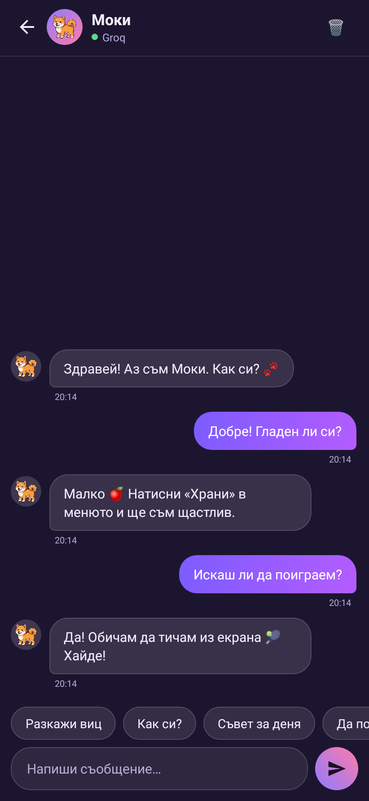
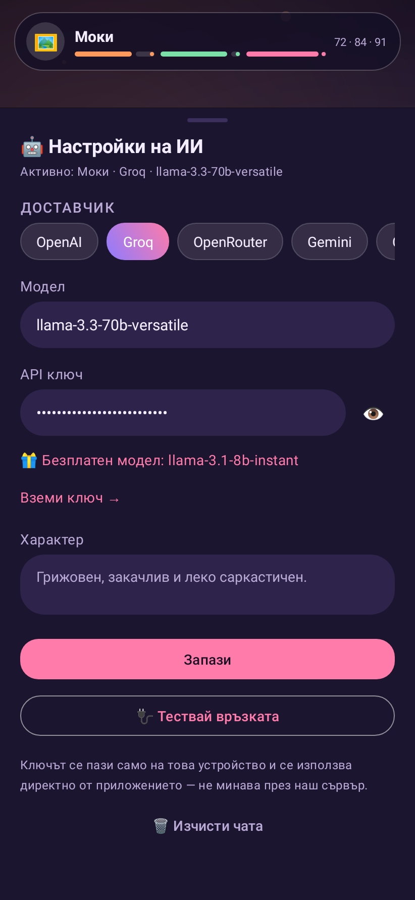
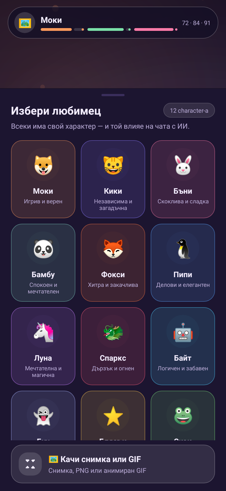

# 🐾 Emotion Pet — Peta

Мобилно Android приложение с **виртуален любимец**, който живее на екрана ти: разхожда се сам, реагира на докосване, има си статове и собствен чат с **изкуствен интелект** с твой API ключ.

По подразбиране новите инсталации получават **Peta** 😈 — постоянен AI спътник по концепцията „Един Peta, много мозъци": героят си остава един и същ, а от **Brain Lab** сменяш само неговия „мозък" (ChatGPT/Claude/Gemini/Groq/OpenRouter/собствен). Долна навигация: **Начало · Задачи · Агенти · Памет · Още**. Старите 12 emoji-любимеца (Моки, Кики…) остават достъпни от избора на любимец, за който вече е свикнал.

> Kotlin · minSdk 24 (Android 7) · без сървър · всичко локално

---

## Екрани



| Стаята | Менюто | Чатът | Настройки на ИИ | Избор на любимец |
|---|---|---|---|---|
| [](docs/screenshots/01-room.png) | [](docs/screenshots/02-menu.png) | [](docs/screenshots/03-chat.png) | [](docs/screenshots/04-ai.png) | [](docs/screenshots/05-pets.png) |

> Снимките не са монтаж — истинските `MainActivity`, `MenuSheet`, `ChatActivity` и `AiSheet` се рендерират в PNG от `ScreenshotTest` (Robolectric) при всеки push, а CI ги качва в `docs/screenshots/`.

---

## Какво може

| | |
|---|---|
| 🐕 **Живее на екрана** | Разхожда се сам из стаята, спира да почине, понякога тича с всичка сила. Докоснеш ли го — реагира и казва нещо. |
| 😈 **Peta + 12 класически любимци** | Peta е новият спътник по подразбиране (вграден образ, не emoji). Плюс Моки 🐶, Кики 🐱, Бъни 🐰, Бамбу 🐼, Фокси 🦊, Пипи 🐧, Луна 🦄, Спаркс 🐲, Байт 🤖, Буу 👻, Блясък ⭐ и Скок 🐸 — всеки със свой характер, цвят и глас в чата. |
| 🧪 **Brain Lab** | Отделен екран за смяна на активния AI „мозък" — карта за всеки доставчик с кратка характеристика; изборът се пази веднага, а ⚙ настройките (ключ/модел) са на един тап разстояние. |
| ✅ **Задачи** | Прост локален списък със задачи — добави, отметни, изтрий. Без известия, само памет на телефона. |
| 🧠 **Памет** | Отделни бележки, които искаш Peta да помни — виждаш ги и трием поотделно, независимо от чата. |
| 🏀 **Отскача от стените** | DVD-стил: любимецът се отблъсква с възстановяване на скоростта, сплесква се при удар (squash & stretch), рисува ударна вълна и искри. Можеш да го изключиш от менюто. |
| ✨ **Модерна стая** | Градиентни палитри (Тъмнина, Залез, Мента, Океан), стъклени карти, цветен ореол около любимеца, плаващи светлинки. |
| 🖼 **Къстам образ** | Качи своя снимка, PNG или **анимиран GIF** от галерията, или избери от 30 готови emoji-та. Регулираш размер, скорост и огледален образ. |
| 🤖 **Чат с ИИ** | Един бутон „Чат" отдолу вдясно. С API ключ (OpenAI, Groq, OpenRouter или собствен OpenAI-съвместим сървър) любимецът говори наистина умно. Без ключ отговаря вградената логика — работи и офлайн. |
| 🍎 **Грижа** | Храни го, играй с него, сложи го да спи, погали го. Ситостта, енергията и настроението се менят с времето — ако не се грижиш, любимецът огладнява и заспива. |
| 🖐 **Хвърляне** | Хвани го с пръст и го занеси къде искаш — или го метна, с инерция. |
| 🖼 **Фон на стаята** | Собствена снимка от галерията като фон (или една от четирите палитри). |
| 💬 **Памет** | Чатът се помни между пусканията. |
| 🔒 **Поверителност** | Всичко (образ, статове, история, API ключ) се пази само на телефона. Няма наш сървър, няма акаунти. |
| 🏠 **Widget на началния екран** | Показва аватара и статовете на любимеца на home screen-а; тап отваря приложението. |
| 🪟 **Плаващ прозорец** | Любимецът може да плава като малък балон над другите приложения — влачиш го, тап отваря Emotion Pet, задържане го скрива. |
| 📳 **Тактилна обратна връзка** | Леко вибрира при досег с любимеца, по-осезаемо при действие от менюто. |

---

## Инсталиране на телефона

**Директна връзка (последна компилация):**

📥 **https://github.com/rrusev548/Emotion/releases/download/latest-build/EmotionPet-debug.apk**

1. Отвори линка **на телефона** и изтегли APK-а (~6 MB).
2. Отвори файла. Android ще поиска разрешение **„Инсталиране на непознати приложения"** за браузъра/файловия мениджър — разреши го.
3. Готово. Иконата е с розово сърце, приложението се казва **Emotion Pet**.

> Всеки успешен build обновява този release автоматично (виж `.github/workflows/android.yml`).
> APK-ът е *debug* — подписан с debug ключ, идеален за лично ползване и тестване.

---

## Настройка на ИИ (по избор)

Меню (⚙️) → **🤖 Настройки на ИИ**:

| Доставчик | Ключ от | Безплатен модел |
|---|---|---|
| **Groq** (най-бърз) | console.groq.com/keys | `llama-3.1-8b-instant` |
| **OpenRouter** | openrouter.ai/keys | `meta-llama/llama-3.3-70b-instruct:free` |
| **OpenAI** (GPT) | platform.openai.com/api-keys | — |
| **Gemini** | aistudio.google.com/apikey | безплатен таван през AI Studio |
| **Claude** | console.anthropic.com/settings/keys | — |
| **Custom** | всеки OpenAI-съвместим сървър | Ollama, LM Studio, локален прокси |

> Gemini минава през официалния OpenAI-съвместим ендпойнт на Google. Claude ползва нативния Anthropic Messages API (различен формат — вграден директно в `AiClient`).

1. Избери доставчик (чип).
2. Постави ключа в полето **API ключ**.
3. Натисни **🔌 Тествай връзката** — трябва да изпише „Връзката работи ✓".
4. **Запази**.

Настройките и ключът се пазят в `SharedPreferences` на устройството (`android:allowBackup="false"` за файла, за да не излиза ключът от телефона).

---

## Компилиране от сорс

```bash
git clone https://github.com/rrusev548/Emotion.git
cd Emotion
./gradlew assembleDebug        # APK → app/build/outputs/apk/debug/
./gradlew installDebug         # директно на свързан телефон (USB debugging)
./gradlew testDebugUnitTest    # unit тестовете
```

Изисква JDK 17 и Android SDK (compileSdk 35). CI-то в `.github/workflows/android.yml` прави точно това при всеки push.

---

## Структура

```
app/src/main/java/com/emotion/pet/
├── MainActivity.kt      # стаята: любимецът, HUD, долна навигация, бързи действия
├── PetView.kt           # рисуване + физика: ходене, инерция, балончета, сън
├── MenuSheet.kt         # bottom sheet менюто (грижа · образ · стая · ИИ · Още)
├── BrainLabActivity.kt  # смяна на активния AI "мозък" (карти по доставчик)
├── TasksActivity.kt     # задачи — добави/отметни/изтрий
├── MemoryActivity.kt    # памет — бележки за Peta, добавяне/изтриване
├── TaskStore.kt         # локален JSON стор за задачите
├── MemoryStore.kt       # локален JSON стор за паметта
├── AiSheet.kt           # настройки на ИИ доставчика (ключ/модел/base URL)
├── ChatActivity.kt      # чатът
├── ChatAdapter.kt       # балончета в чата
├── AiClient.kt          # HTTP клиент за /chat/completions + нативен Claude /messages
├── SmallBrain.kt        # отговори без ключ (офлайн режим)
├── ChatStore.kt         # история на чата + системен prompt
├── SpriteStore.kt       # качен образ и фон (копират се във filesDir)
├── Prefs.kt             # всички настройки
├── Presets.kt           # любимци (вкл. Peta), палитри, ИИ доставчици
├── Needs.kt (в Main)    # чиста логика на статовете + unit тест
└── Ui.kt                # дребни помощни функции
```

Няма външни мрежови/ИИ библиотеки — само `HttpURLConnection` + `org.json`, така че APK-ът е малък и няма скрити зависимости.

---

## Идеи за следващо

- [x] Widget на home screen — аватар + статове, тап отваря приложението (`PetWidgetProvider`)
- [x] Нативен Android **overlay** — любимецът плува балон над другите приложения (`OverlayService`, меню → 🪟 Плаващ прозорец)
- [x] Peta — постоянен character с вграден образ + „много мозъци" (`BrainLabActivity`)
- [x] Задачи + Памет като самостоятелни екрани
- [ ] Auto mode за избор на мозък според задачата
- [ ] Гласов режим
- [ ] Разучаване на нови думи/команди („хайде навън")
- [ ] Синхронизация на образа с любима снимка чрез AI стилизация

Кажи какво искаш и го добавяме. 🐾
